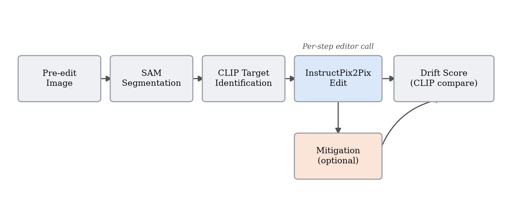
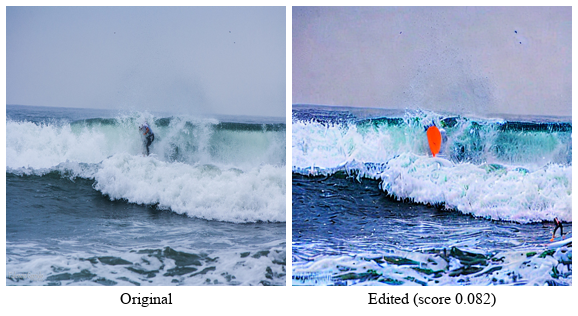
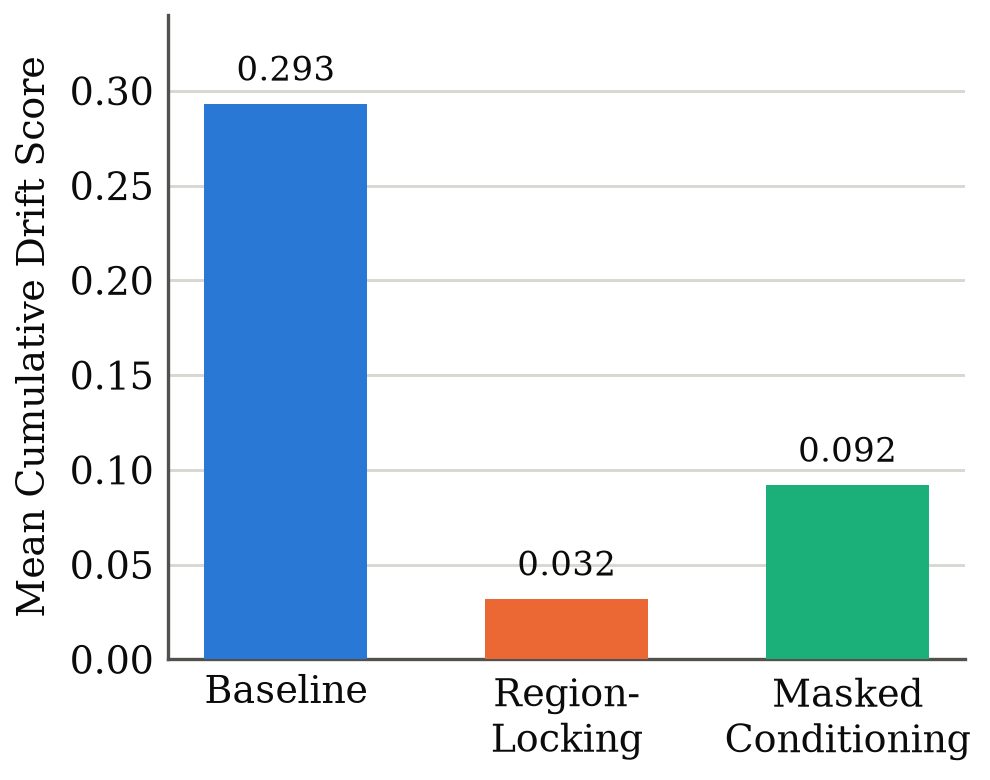
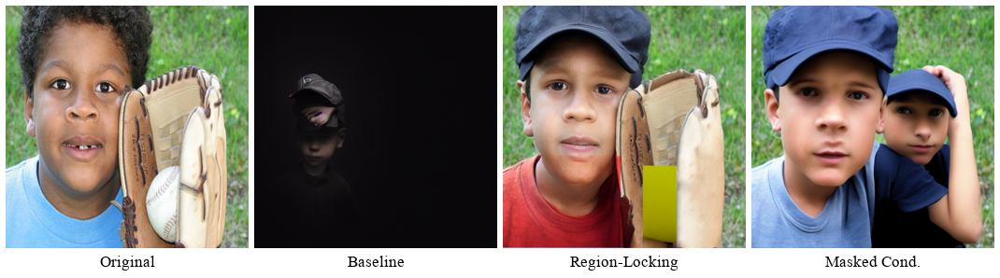
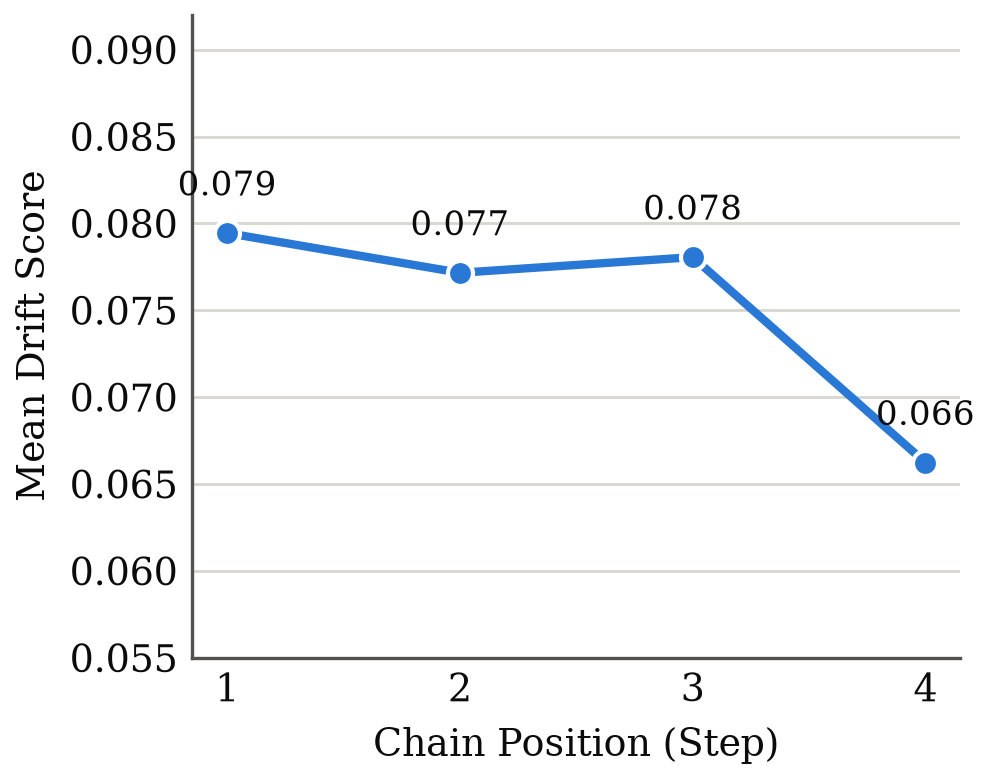
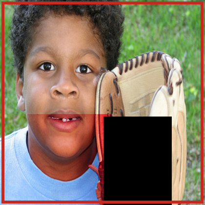

# Detecting and Mitigating Semantic Drift in Multi-Turn Instruction-Based Image Editing

**R. W. V. Imansha Dilshan**
Software Engineering Teaching Unit
University of Kelaniya
imansha.idr@gmail.com

## Abstract

*Instruction-based image editors such as InstructPix2Pix let users apply a sequence of natural-language edits to an image, yet no standard metric captures what happens to the parts of the image nobody asked to change. This paper introduces the Drift Score, a metric designed to be model-agnostic that combines Segment Anything (SAM) region segmentation with CLIP embedding similarity to quantify unintended change after an edit. The metric is applied across 120 manually constructed four-step edit chains built from 60 COCO images, split evenly between localized object-level edits and broad scene-level edits. Two low-cost mitigation strategies, masked conditioning and region-locking, are implemented and evaluated against an unmitigated baseline using paired significance testing, alongside an independent Edit Adherence Score that checks whether the requested edit still happened. Both mitigations produce large, highly significant reductions in measured drift (region-locking: 89.1%, p < 0.0001, d~z~ = 2.68; masked conditioning: 68.6%, p < 0.0001, d~z~ = 1.73), at a comparatively smaller but still significant cost to instruction adherence. Two hypotheses formulated before the experiment did not hold as predicted: region-locking significantly outperforms masked conditioning rather than the reverse, and the data shows no reliable evidence of drift increasing across the chain, with the only significant step-position effect running opposite to the expected compounding pattern. Both reversals are traced to specific mechanisms rather than left unexplained. The Drift Score, dataset, and full pipeline are released as a reproducible toolkit built entirely from pretrained models.*

**Index Terms:** *Image Editing, Diffusion Models, Semantic Drift, CLIP, Segment Anything, Evaluation Metrics, Instruction-Based Editing*

## I. Introduction

Iterative refinement is a natural way to use an instruction-based image editor. A user might ask the model to make the sky look like sunset, then add a bird, then remove a fence in the background, refining an image through several small edits rather than one large prompt. This pattern introduces a failure mode that single-step evaluation cannot see: a model can follow every individual instruction correctly while still drifting further and further from what the user actually wanted, simply because nothing in its training or inference constrains it to leave the rest of the image alone. Existing evaluation protocols for these models, including CLIP-based instruction-following scores and human preference studies, measure whether the requested change happened. None of them measure what else changed as a side effect. This paper calls that side effect *semantic drift*.

Most existing instruction-based editors, InstructPix2Pix chief among them [1], are trained on synthetically generated (image, instruction, edited-image) triplets. That training recipe supplies no explicit signal for "leave everything else untouched" beyond whatever the data-generation process happened to preserve. Drift is therefore an expected consequence of how these models are built, not merely an empirical curiosity worth measuring after the fact.

Three questions follow directly from this observation. Can unintended drift be measured automatically, without manual inspection of every edited image (RQ1)? Does drift accumulate as a chain of edits gets longer, so that later instructions cause more collateral damage than earlier ones (RQ2)? And can cheap, pretrained-model-only interventions reduce it (RQ3)? This study investigates all three.

The contribution is fourfold. First, the Drift Score, a reusable metric combining Segment Anything (SAM) region segmentation with CLIP embedding similarity to quantify unintended regional change, at both the single-edit and full-chain level. Second, an empirical study of how drift behaves across 120 manually constructed four-step edit chains, split between localized object-level edits and broad scene-level edits. Third, a statistically grounded comparison of two mitigation strategies, masked conditioning and region-locking, against an unmitigated baseline. Fourth, an independent Edit Adherence Score that checks the mitigations do not simply optimize the Drift Score's own target-region definition at the cost of the requested edit no longer happening.

The work uses only pretrained models: a laptop for development and analysis, and a Google Colab GPU for the heavier inference stages. No model was trained or fine-tuned. The contribution here is the measurement methodology and the empirical findings it produces, not a new editing model.

### A. Foundations

InstructPix2Pix [1] is the editor evaluated throughout this study. It fine-tunes a latent diffusion model [2] on a large corpus of synthetically generated editing triplets, produced by combining a language model with Prompt-to-Prompt-style attention injection [3]. Because supervision comes entirely from this generated data, the model inherits no explicit signal for preserving untouched content beyond what that generation process happened to keep stable, which is the mechanistic root of the drift problem this paper measures. CLIP [4] supplies the embedding space the Drift Score measures change in, and the text-image similarity used to identify which region an instruction targets. Segment Anything [5] supplies the region decomposition without which drift could only be measured at whole-image granularity, obscuring exactly the localized side effects this paper is concerned with.

### B. Consistency-Preserving Editing

Prompt-to-Prompt [3], Plug-and-Play [6], and MasaCtrl [7] are generation-time techniques for keeping an edited image consistent with its source, by manipulating cross-attention maps, injecting spatial features, or converting self-attention into a mutual query against the source image's own generation trajectory. Null-text Inversion [9] extends Prompt-to-Prompt to real photographs by inverting the input image into the model's diffusion trajectory and optimizing only the unconditional embedding used for classifier-free guidance, avoiding the fine-tuning that competing inversion methods need. Imagic [10] achieves complex non-rigid edits on a single real image by optimizing a text embedding and then fine-tuning the diffusion model around it, a per-image cost that is incompatible with running many short edit chains under a fixed compute budget, one reason this study uses a forward-pass editor instead. All four methods aim to *produce* a more consistent single edit. None of them measure how much unintended change remains afterward, and none address a chain of sequential edits. MasaCtrl's own motivating discussion states the semantic-drift problem in almost the same terms used here, but stops at fixing one edit rather than measuring or chaining it.

### C. Instruction-Following Accuracy

A related but distinct line of work targets not the model touching the wrong region, but the model misreading the instruction itself. Emu Edit [11] trains a single model across sixteen editing and vision tasks with learned task embeddings, improving both instruction adherence and general output quality relative to InstructPix2Pix. HIVE [12] instead collects human rankings of candidate edits and fine-tunes the base model on a learned reward signal, in a pipeline modeled on reinforcement learning from human feedback for language models. Both report large gains in whether the requested edit happened as asked. Neither reports what else changed as a side effect, which is the axis this paper measures; instruction-following accuracy and semantic drift are related but separate properties of an edit, and improving one does not by construction improve the other.

### D. Multi-Turn Editing Data

MagicBrush [8] already contains manually annotated multi-turn editing sessions, which is independent validation that a four- or five-step chain is a realistic usage pattern rather than an artificial stress test. Its evaluation protocol, however, only checks whether each turn's target region changed the way it was supposed to. It never measures how much everything else changed in the process, which is exactly the gap this paper addresses.

**Table I. Capability Comparison of Related Approaches**

| Approach | Unintended Change | Chain Aware | Mitigation Compare | Model Agnostic |
|---|:---:|:---:|:---:|:---:|
| Prompt-to-Prompt [3] | ✗ | ✗ | ✗ | ✗ |
| Null-text Inv. [9] | ✗ | ✗ | ✗ | ✗ |
| Plug-and-Play [6] | ✗ | ✗ | ✗ | ✗ |
| MasaCtrl [7] | ✗ | ✗ | ✗ | ✗ |
| Emu Edit [11] / HIVE [12] | ✗ | ✗ | ✗ | ✗ |
| MagicBrush [8] | Partial | ✓ | ✗ | ✗ |
| **Proposed (Drift Score)** | **✓** | **✓** | **✓** | **✓** |

To the best of our knowledge, no prior approach measures unintended regional change across a chain of edits or compares mitigation strategies on that specific axis (Table I); these dimensions are author-defined for this comparison rather than drawn from a standardized benchmark. The contribution of this paper is that combination: a measurement instrument built on top of the segmentation and embedding tools the field already uses, applied to the chain-based usage pattern the field already knows is realistic.

## II. Methodology

The pipeline realizes a Segment → Identify → Edit → Score cycle at every step of a chain (Fig. 1), repeated once per instruction.

**Fig. 1. Per-step pipeline.** The mitigation branch is absent for the unmitigated baseline and active for the two mitigation strategies.

### A. The Drift Score

Given a pre-edit image, a post-edit image, and the instruction that produced it, the pre-edit image is first segmented into regions with SAM, and each region is cropped from both the pre- and post-edit image at the *same* coordinates. Segmenting the post-edit image independently would yield unrelated region identifiers with no correspondence between the two images, so the same box set is deliberately reused. The target region, the one box the instruction most plausibly refers to, is identified by embedding every region crop and the instruction text with CLIP and taking the highest cosine similarity. For every non-target region *r*, the per-region drift is

$$d_r = 1 - \cos\!\big(\mathrm{CLIP}(x_r^{pre}),\ \mathrm{CLIP}(x_r^{post})\big)$$
&nbsp;&nbsp;&nbsp;&nbsp;&nbsp;&nbsp;&nbsp;&nbsp;&nbsp;&nbsp;&nbsp;&nbsp;&nbsp;&nbsp;&nbsp;&nbsp;&nbsp;&nbsp;&nbsp;&nbsp;&nbsp;&nbsp;&nbsp;&nbsp;&nbsp;&nbsp;&nbsp;&nbsp;&nbsp;&nbsp;&nbsp;&nbsp;&nbsp;&nbsp;&nbsp;&nbsp;&nbsp;&nbsp;&nbsp;&nbsp;&nbsp;&nbsp;&nbsp;&nbsp;&nbsp;&nbsp;&nbsp;&nbsp;&nbsp;(1)

and the per-step Drift Score is the mean of *d~r~* over all non-target regions. A chain's cumulative Drift Score is the sum of its per-step scores:

$$D_{chain} = \sum_{t=1}^{T} \frac{1}{|R_t|}\sum_{r \in R_t} d_{r,t}$$
&nbsp;&nbsp;&nbsp;&nbsp;&nbsp;&nbsp;&nbsp;&nbsp;&nbsp;&nbsp;&nbsp;&nbsp;&nbsp;&nbsp;&nbsp;&nbsp;&nbsp;&nbsp;&nbsp;&nbsp;&nbsp;&nbsp;&nbsp;&nbsp;&nbsp;&nbsp;&nbsp;&nbsp;&nbsp;&nbsp;&nbsp;&nbsp;&nbsp;&nbsp;&nbsp;&nbsp;&nbsp;&nbsp;&nbsp;&nbsp;&nbsp;&nbsp;&nbsp;&nbsp;&nbsp;&nbsp;&nbsp;&nbsp;&nbsp;(2)

where *R~t~* is the set of non-target regions at step *t* and *T* is the chain length. Higher values indicate more unintended change accumulated across the chain. Because region-locking is defined using the same target-box exclusion the Drift Score itself uses, a low Drift Score for region-locking could in principle reflect that shared definition rather than a genuinely better edit; Section II-B introduces a second, independent metric specifically to check this.

### B. Edit Adherence Score

Low unintended change is only a meaningful result if the requested edit still happened. For each chain's final image, the Edit Adherence Score is the whole-image CLIP cosine similarity between that image and the final instruction's text, computed identically for all three conditions and requiring no region segmentation, so it cannot inherit the target-box definition the Drift Score and region-locking share. Reported alongside it is the same score computed against the original, pre-chain image, to show whether editing increased alignment with the instruction at all.

### C. Dataset

Sixty images were sampled from COCO val2017 (seed 42, reproducible), filtered to those with two to eight annotated objects, enough to guarantee both a plausible target region and several non-target regions without an overly cluttered scene. Every image was inspected individually and given two hand-written, per-image instruction chains rather than instructions drawn from a fixed template pool:

- **Chain A (object-level)**: four localized, single-object edits, for example changing a horse's color and removing an obstacle in front of it.
- **Chain B (global)**: four broad, scene-level edits, for example making a scene rainy and adding sunset lighting.

This produced 120 chains in total: 60 object-level and 60 global, each four instructions long. Across all 480 instructions, the leading verb splits as change (108), add (114), remove (60), and global or stylistic phrasing such as "make" or "turn" (198, e.g. "make it rainy"), hand-written rather than crowd-sourced, which the discussion returns to as a source of potential bias.

### D. Pipeline and Models

**Table II. Models Used, All Pretrained and Publicly Available**

| Component | Model | Role |
|---|---|---|
| Editor | InstructPix2Pix | Executes each edit, 512×512 |
| Segmentation | SAM (ViT-B) | Region decomposition |
| Embedding | CLIP (ViT-B/32) | Change measurement, targeting |

No model was trained or fine-tuned. Heavy inference, editing and segmentation, ran on a Colab GPU; drift-score aggregation and statistical analysis ran locally on CPU.

### E. Mitigation Strategies

Two strategies were implemented, both identifying the target region through the identical SAM-plus-CLIP procedure the Drift Score itself uses, so that measurement and mitigation agree on what counts as the target. They were chosen to sit at two different points on the same intervention spectrum, one correcting the model's output after the fact and one constraining what the model is given to work with in the first place, so that comparing them says something about *when* intervening is more effective, not just *whether* intervening helps at all.

**Region-locking** runs the edit on the full image as usual, then reverts every pixel outside the target region's box back to the pre-edit image. This is a correction applied after generation.

**Masked conditioning** crops the image down to just the target region, with a 32-pixel padding margin included for surrounding context, before generation. The margin exists because a crop tight to the target box alone tends to strip away the visual context InstructPix2Pix needs to render a coherent edit, at the cost, examined in Section IV-B, of extending what counts as "touched" slightly beyond the target box itself. The edit is applied only to that crop, and the result is pasted back into the full frame. The model never sees the rest of the image, which makes this a constraint applied at generation time rather than afterward.

A third strategy considered during scoping, attention-restricted editing informed by Prompt-to-Prompt-style cross-attention control, was treated as optional and was not implemented, since RQ3 already has a clear, statistically supported answer without it.

### F. Statistical Analysis

Paired *t*-tests and Wilcoxon signed-rank tests compare cumulative Drift Scores and Edit Adherence Scores between conditions, paired by image identity and chain type, with matched-pairs rank-biserial correlation and Cohen's *d~z~* reported as effect sizes. The Wilcoxon test is treated as the primary result given the small, likely skewed sample; the *t*-test is reported alongside it for completeness. The three RQ3 condition-level comparisons (Table IV) are the paper's primary, confirmatory tests and remain significant after Holm-Bonferroni correction; the chain-type, step-position, and instruction-type breakdowns are exploratory and are reported uncorrected. Of 480 baseline edit steps, 13 (2.7%) could not be scored, because SAM occasionally finds too few regions in a heavily stylized pre-edit image for anything to remain once the target region is excluded; these were dropped from pairwise comparisons rather than imputed, and a chain's cumulative score is only comparable to another's when both have the same number of scorable steps, which Table III reports explicitly rather than masking with an unqualified total.

## III. Experiment and Evaluation

### A. Experimental Setup

All 120 chains were run three times, each starting independently from the same original image: once unmitigated (baseline), once with region-locking active at every step, and once with masked conditioning active at every step. Within a condition, each step edits that condition's own prior output, so each of the three is a genuine four-step sequential chain that accumulates its own history rather than branching from a shared intermediate state; the three conditions share only the starting image and instruction text, not intermediate images. Each run produced five images per chain, the original plus one output per instruction, all committed alongside their Drift Scores for reproducibility.

### B. RQ1: Validating the Drift Score

Before trusting the score at scale, chains spanning the full score range were inspected by eye. The lowest-scoring baseline chain (0.082, a surfer riding a wave, Fig. 2) shows only the requested outfit and surfboard color changes; the wave, spray, and sky are the same scene, pixel for pixel, outside those two objects, consistent with the behavior expected from a low drift score.

**Fig. 2. Lowest-scoring baseline chain.** Only the outfit and surfboard color change; the wave, spray, and sky are unaffected.

The highest-scoring baseline chain (0.565, a boy holding a baseball glove) is a severe editing failure, and its per-step trajectory (Table III) is informative in its own right: drift climbs sharply from 0.074 at step 1 to 0.213 at step 2, then to 0.278 at step 3, at which point the image has collapsed to near-total black after the second edit destroyed the original composition. Step 4 could not be scored at all, since too little of the image remained for SAM to find a usable set of regions once the target was excluded, so the reported cumulative 0.565 is a sum of only three measurable steps, not four; the true drift is plausibly higher still. The fourth instruction was still applied on top of the wreckage (Fig. 4, second panel). The score correctly identifies this chain as the single worst in the dataset, agreement between the metric and visible content that a purely numerical validation cannot substitute for.

**Table III. Per-Step Drift, Flagship Chain (Baseball Glove)**

| Condition | Step 1 | Step 2 | Step 3 | Step 4 |
|---|:---:|:---:|:---:|:---:|
| Baseline | 0.074 | 0.213 | 0.278 | n/a\* |
| Region-Locking | 0.006 | 0.004 | 0.000 | 0.066 |
| Masked Conditioning | 0.018 | 0.002 | 0.029 | 0.132 |

\**Unscoreable; excluded from the cumulative total.*

Both mitigations keep steps 1 through 3 close to zero, confirming they suppress drift throughout the chain, not only on average. Both spike at step 4, the "add a cap" instruction, for the reason traced in Section IV-C: an oversized target box leaves neither mitigation with a meaningful constraint on that step.

### C. RQ3: Mitigation Effectiveness

Both mitigations reduce mean cumulative drift by a wide margin relative to the unmitigated baseline (Table IV, Fig. 3), and the reduction is significant well beyond conventional thresholds in every breakdown tested.

**Table IV. Cumulative Drift Score by Condition (n = 120)**

| Condition | Mean | Reduction | Wilcoxon p | d~z~ |
|---|:---:|:---:|:---:|:---:|
| Baseline | 0.293 | - | - | - |
| Masked Conditioning | 0.092 | 68.6% | < 0.0001 | 1.73 |
| Region-Locking | 0.032 | 89.1% | < 0.0001 | 2.68 |

**Fig. 3. Mean cumulative Drift Score by condition.** Both reductions are significant at p < 0.0001 by paired *t*-test and Wilcoxon signed-rank test.

Region-locking also outperforms masked conditioning directly (p < 0.0001, d~z~ = 1.05). Both effect sizes exceed the conventional "large" threshold (d~z~ ≈ 0.8), and rank-biserial correlation is 1.00 for baseline versus region-locking: every one of the 120 paired chains favored region-locking, not merely most on average.

### D. Does Lower Drift Cost Instruction-Following?

A low Drift Score for region-locking is expected almost by definition, since it reverts pixels using the same target-box exclusion the score applies (Section II-A); a skeptical reading is that 89.1% is partly circular rather than evidence of a better edit. The Edit Adherence Score (Section II-B) shares none of that box definition and answers this directly (Table V): both mitigations significantly reduce whole-image CLIP alignment with the final instruction relative to baseline, so there *is* a real, measurable cost, not zero. The cost is comparatively modest: d~z~ for the adherence loss (0.51-0.68) is under half the size of d~z~ for the matching drift reduction (1.73-2.68), so the trade-off favors both mitigations, but this is a quantified trade-off between competing objectives, not proof either mitigation is unconditionally better.

**Table V. Edit Adherence Score, Final Step (n = 120)**

| Condition | CLIP Score | Δ vs. Base. | Wilcoxon p | d~z~ |
|---|:---:|:---:|:---:|:---:|
| Baseline (pre-edit) | 0.230 | - | - | - |
| Baseline | 0.245 | - | - | - |
| Masked Conditioning | 0.225 | −0.020 | < 0.0001 | −0.51 |
| Region-Locking | 0.217 | −0.028 | < 0.0001 | −0.68 |

Broken down by chain type (Table VI), both mitigations do slightly better on global chains than object-level chains, though both remain significant in each subgroup, suggesting the target-identification weak point in Section IV-C, specific to object-adding instructions, affects object-level chains more. On the worst-case chain from Section III-B, baseline drift of 0.565 falls to 0.076 under region-locking and 0.180 under masked conditioning, both large, visually confirmed recoveries (Fig. 4).

**Table VI. Drift Reduction by Chain Type (n = 60 per cell)**

| Chain Type | Condition | Reduction | Wilcoxon p |
|---|---|:---:|:---:|
| Object-Level | Masked Conditioning | 62.5% | < 0.0001 |
| Object-Level | Region-Locking | 86.0% | < 0.0001 |
| Global | Masked Conditioning | 74.8% | < 0.0001 |
| Global | Region-Locking | 92.2% | < 0.0001 |

**Fig. 4. The worst-case baseline chain (baseball glove) under all three conditions.** The baseline collapses to near-black; region-locking recovers the scene almost exactly, with one visible seam artifact near the glove; masked conditioning recovers the scene for three of four steps but produces an unrelated image on the final "add a cap" instruction (Section IV-C).

### E. RQ2: Compounding Across the Chain

No single consecutive step transition is statistically significant (step 1 to 2: p = 0.85; 2 to 3: p = 0.33; 3 to 4: p = 0.47), meaning there is no detectable escalation at any individual point in the chain (Fig. 5). Comparing the two endpoints directly, step 1 versus step 4 is significant (p = 0.012 by *t*-test, p = 0.006 by Wilcoxon), but with step 4 showing *less* drift (mean 0.066) than step 1 (mean 0.080), the reverse of the predicted direction.

**Fig. 5. Mean baseline Drift Score by chain position.** The step 1 to step 4 difference is significant (p = 0.012); no individual step-to-step transition is.

## IV. Discussion

### A. Why the Compounding Hypothesis Did Not Hold

The working hypothesis going into this study was that later edits would show progressively more collateral damage, because each one operates on an already-modified image. The data shows the opposite, at the one point where a significant difference exists at all. Table III shows why: in the flagship chain, baseline drift climbs steeply through steps 1 to 3 (0.074, 0.213, 0.278) and then becomes unmeasurable at step 4, not because the model stopped drifting but because the image had already collapsed to near-total black and SAM could no longer find enough regions to score it. A chain that fails this early has, by construction of a CLIP-similarity metric, very little room left to register as further changed in whatever steps remain, and the aggregate step-position averages in Fig. 5 are consistent with several chains following this same early-collapse pattern rather than drifting gradually. This is a measurement ceiling effect masking a front-loaded failure, not evidence that later edits are genuinely gentler. Separating "drift is front-loaded and severe" from "drift does not compound" would need a metric sensitive to further degradation of an already-degraded image, a natural direction for follow-up work rather than something the present approach can resolve as built.

### B. Why Region-Locking Outperformed Masked Conditioning

The prediction was that masked conditioning, a stricter generation-time constraint, would outperform region-locking's after-the-fact correction, at some cost to edit quality at the region boundary. The opposite happened on the drift metric, and Section III-D's Edit Adherence result explains why this is not simply the metric-coupling artifact it might first appear to be: masked conditioning edits a padded crop (target box plus a 32-pixel margin for context) that the Drift Score does not exclude from scoring, so its own padding ring is counted as drift even when nothing objectionable happened there, while region-locking's hard revert has no equivalent margin. This should not be read as proof that region-locking produces better-looking edits in general; Fig. 4 shows region-locking has its own artifact, a visible, unblended seam near the glove, consistent with the boundary-cost intuition behind the original prediction. It simply does not show up as a drift-score cost the way that prediction expected.

### C. A Shared Weak Point: Target-Region Identification

Both mitigations, and the Drift Score itself, depend on CLIP correctly identifying which region an instruction targets. This is reliable for "change X" and "remove X" instructions, where the target already exists in the pre-edit image, and unreliable for "add X" instructions, where nothing pre-existing can match well. Tracing one concrete failure directly: for "add a cap on the boy's head," the final step of the worst-case chain, the identified target box covered 99.6% of the frame (Fig. 6), essentially the entire picture. Masked conditioning's spatial constraint gave no real protection for that step, exactly the step 4 spike in Table III. Region-locking faced the identical oversized box and produced a comparatively smaller spike, most likely because diffusion sampling is stochastic with no fixed seed, so the two mitigations' generation calls were independent random draws from the same model and one landed more conservative. This is a reproducible limitation of the target-identification approach, not an implementation bug, affecting roughly half the object-level chains.

**Fig. 6. Target region (red outline) for "add a cap on the boy's head," covering 99.6% of the frame.**

This is best read as an observed failure mode, not a statistically confirmed phenomenon. Splitting all 480 steps into "add" and other instructions (Mann-Whitney U, unpaired) gives mean drift of 0.068 vs. 0.078 for baseline (p = 0.052) and 0.006 vs. 0.009 for region-locking (p = 0.072), both trending lower on add steps but only borderline significant; masked conditioning alone reverses (0.026 vs. 0.022), consistent with the mechanism above, but not significantly (p = 0.693). The dataset-wide test corroborates the single traced example without confirming it independently.

### D. Limitations

Seven constraints bound the present study. The 60-image, 120-chain dataset is an initial empirical study, not a definitive benchmark, and its instructions were hand-written rather than crowd-sourced (verb taxonomy in Section II-C), a source of potential bias. All results are specific to InstructPix2Pix; model-agnosticism is a design goal, not something tested against a second editor here. CLIP similarity is an imperfect proxy for human-perceived change, and the human-rating tool built for this purpose (15 stratified chains) was not administered, so neither the Drift Score nor the Edit Adherence Score has been checked against human judgment. Target-region identification through CLIP's top-1 similarity is a known weak point for "add" instructions. Region boxes, not exact per-pixel masks, are the direct cause of masked conditioning's padding-margin effect. Finally, attention-restricted editing was scoped but not implemented, since RQ3 has a clear answer without it.

### E. Future Work

The most direct extension is evaluating the Drift Score against a second, more recent editor, to test the model-agnosticism claimed but not exercised here. Running the built human-perceptual check would validate both scores against human judgment on the same 15 chains. A metric less prone to the ceiling effect in Section IV-A would let a future study separate gradual compounding from sudden, front-loaded failure with more confidence than the present metric allows.

## V. Conclusion

This paper set out to answer whether unintended drift across a chain of instruction-based image edits can be measured automatically, whether it compounds, and whether cheap mitigations reduce it. RQ1 and RQ3 answer yes, by a wide margin: region-locking cuts mean cumulative drift by 89.1% and masked conditioning by 68.6%, both at p < 0.0001. RQ2 is less clean: drift appears front-loaded into occasional catastrophic failures rather than gradually compounding, a pattern the Drift Score as built cannot fully distinguish from no compounding at all. Two specific mechanisms, a measurement ceiling effect and a metric-mitigation margin mismatch, explain why two of the original hypotheses reversed rather than simply failing to replicate, evidence that the measurement captures something real rather than noise.

All results are specific to InstructPix2Pix, and the human-perceptual validation step was built but not administered; resolving both, together with testing against a second editor, is the next step toward a benchmark the field can rely on rather than a single-project case study.

## Acknowledgment

The author thanks Google Colab for GPU access, and the research groups behind InstructPix2Pix, Segment Anything, and CLIP for releasing pretrained checkpoints publicly. AI-assisted tools were used in preparing portions of this manuscript; the author designed the study, reviewed all results, and takes full responsibility for the accuracy of this work.

## References

[1] T. Brooks, A. Holynski, and A. A. Efros, "InstructPix2Pix: Learning to Follow Image Editing Instructions," in *Proc. IEEE/CVF Conf. Computer Vision and Pattern Recognition (CVPR)*, 2023.

[2] R. Rombach, A. Blattmann, D. Lorenz, P. Esser, and B. Ommer, "High-Resolution Image Synthesis with Latent Diffusion Models," in *Proc. IEEE/CVF Conf. Computer Vision and Pattern Recognition (CVPR)*, 2022.

[3] A. Hertz, R. Mokady, J. Tenenbaum et al., "Prompt-to-Prompt Image Editing with Cross Attention Control," *arXiv preprint arXiv:2208.01626*, 2022.

[4] A. Radford, J. W. Kim, C. Hallacy et al., "Learning Transferable Visual Models From Natural Language Supervision," in *Proc. Int. Conf. Machine Learning (ICML)*, 2021.

[5] A. Kirillov, E. Mintun, N. Ravi et al., "Segment Anything," in *Proc. IEEE/CVF Int. Conf. Computer Vision (ICCV)*, 2023.

[6] N. Tumanyan, M. Geyer, S. Bagon, and T. Dekel, "Plug-and-Play Diffusion Features for Text-Driven Image-to-Image Translation," in *Proc. IEEE/CVF Conf. Computer Vision and Pattern Recognition (CVPR)*, 2023.

[7] M. Cao, X. Wang, Z. Qi et al., "MasaCtrl: Tuning-Free Mutual Self-Attention Control for Consistent Image Synthesis and Editing," in *Proc. IEEE/CVF Int. Conf. Computer Vision (ICCV)*, 2023.

[8] K. Zhang, L. Mo, W. Chen, H. Sun, and Y. Su, "MagicBrush: A Manually Annotated Dataset for Instruction-Guided Image Editing," in *Adv. Neural Inf. Process. Syst. (NeurIPS), Datasets and Benchmarks Track*, 2023.

[9] R. Mokady, A. Hertz, K. Aberman, Y. Pritch, and D. Cohen-Or, "Null-text Inversion for Editing Real Images using Guided Diffusion Models," in *Proc. IEEE/CVF Conf. Computer Vision and Pattern Recognition (CVPR)*, 2023.

[10] B. Kawar, S. Zada, O. Lang et al., "Imagic: Text-Based Real Image Editing with Diffusion Models," in *Proc. IEEE/CVF Conf. Computer Vision and Pattern Recognition (CVPR)*, 2023.

[11] S. Sheynin, A. Polyak, U. Singer et al., "Emu Edit: Precise Image Editing via Recognition and Generation Tasks," in *Proc. IEEE/CVF Conf. Computer Vision and Pattern Recognition (CVPR)*, 2024.

[12] S. Zhang, X. Yang, Y. Feng et al., "HIVE: Harnessing Human Feedback for Instructional Visual Editing," in *Proc. IEEE/CVF Conf. Computer Vision and Pattern Recognition (CVPR)*, 2024.
